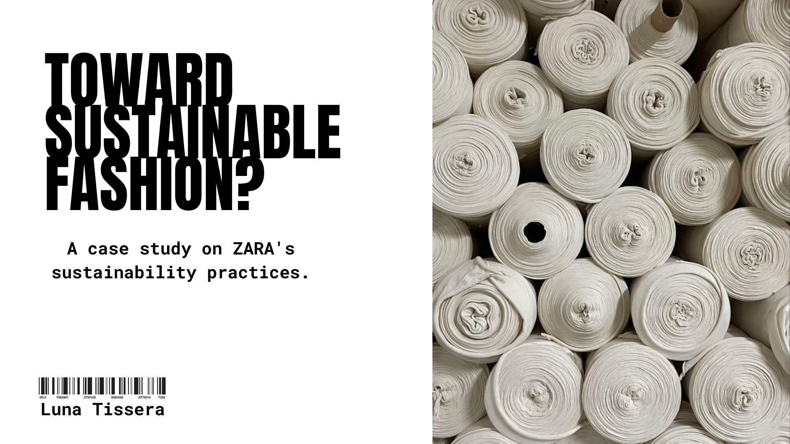

# Toward Sustainable Fashion?
> _A case study on ZARA's sustainability practices._
> This work was my final project of the Data Analyst Bootcamp. It was chosen as the best project!
  

This project analyzes Zara's website to explore the question: **What is Zara doing to be more sustainable?**
- The company has included long legends in the description on their products about how they work in accordance with social and environmental standards, the material of the garments, the percentage of recycled and organic materials, the origin of the products and sustainable certifications in case the products meet certain requirements.
- Then you can find two types of sustainable certifications on their products:
- **OCS:** A certification granted by an independent entity and only for products that contain at least 5% of organic material. 
- **RCS:** also granted by an independent organization and is only for products with recycled material if the recycled material meets the ISO definition of recycled.
- **ZARA PRE-OWNED:** The last initiatives that the company included and it aligns with the concept of circular economy to maximize the product life for as long as possible. Here the brand allows customers to resell, donate and repair products.

## Objectives:
1. Evaluate the inclusion of products with OCS and RCS certifications in the website to determine how many products have certifications and assess the company's environmental commitment.
2. Analyze the prices of products based on the certifications they contain.
3. Analyze the trends of consumers who sell their products in the pre-owned section to understand consumer behavior within the product lifecycle.

## Workflow:
**Data Collection:** Web scraping on ZARA's website using selenium for dinamic webpage to obtain product name, price & description. 
- For the scrip about web scrapping of Zara: [click here](notebook_web_scraping)
- Click here to see the raw data: [data/raw](data/raw)

**Data Cleaning:** Since the data was obtained through web scraping, the cleaning process was quite complex. 
Specifically, there was a column containing lists, which required special handling. We created a function to iterate over all the elements of these lists, access their components, transform them into strings, and then assign the relevant information to new columns:
**All the information was over Description Column (correponding on section view more in the web)**:
- **Made_in**: Extracted the origin of the products from the description.
- **Materials**: Separated the materials of the cloth such as cotton, polyamide, polyester, etc.
- **Recycled Materials**: Further separated into categories like recycled cotton, recycled polyester, recycled polyamide, etc.
- **Percentage Composition**: Assigned the percentage of each material's composition in accordance with each row.
- **OCS and RCS**: Created columns for OCS (Organic Content Standard) and RCS (Recycled Content Standard) based on the descriptions obtained during scraping.
- Click here to see the data after data cleaning: [data/raw](data/clean)

**Data Visualization:**  Find visualization in Tableau: [Click here:](https://public.tableau.com/app/profile/luna.tissera/viz/Tableau_ZARA_2/Historia1?publish=yes)  

## Conclutions based on data: 

**TSHIRT SECTION**:
This section provides a detailed overview of the analysis of the T-shirt category. And  here we note that the products with the most certifications are seasonal T-shirts, because of the high quantity of this type of product available on the website due the summer season.
It is important to note that the main composition of the T-shirts is cotton and most of them contain organic or recycled cotton, but not all of them have sustainable certifications. Only 26% of the products have at least one of these certifications.
In this chart, we can see that the products have more OCS certification than RCS certification but also there are a lot of t-shirts with recycled or organic material without certification.
Also this is an interesting chart that groups certifications according to their origin, with Bangladesh having the highest number of OCS certifications. This makes sense because it is one of Zara's primary suppliers of cotton products.
And finally this chart shows the relationship between price and certifications, where products are grouped on the certifications they hold and we can observe that products with more certifications have a higher price compared to the standard T-shirts priced.

**JEAN SECTION**:
This section provides insights obtained from the analysis of the Jeans category and follows the same logic as the t-shirt section.
But here we can see that the Jeans have a 61% of certification, higher than T-shirts. And they have double certifications in most of the products which contain recycled cotton or polyester and organic cotton. Maybe it is because Zara appears to be focused on fully certifying this category.
Turkey, Bangladesh and Pakistan are the main suppliers of certified jeans. The most certified jeans tend to cost between €25 and €29, and is a high price for jeans.

**PRE-OWNED**:
This last section provides insights obtained from the analysis of the Pre-owned category and shows the life that consumers give to the products.
Consumers mainly sell products from the previous or current season, with few items older than three years suggesting that consumers prefer to buy, use and re-sell products indicating a short life of the product. 
Likewise, this interesting graph shows that most products are sold as “new with tags” or “like new”, indicating minimal use before resale.
And finally, the popularity of dresses in this category suggests a tendency to buy new garments for special events instead of reusing old.

In conclusion, I consider it a good practice to include this type of certification on products to contribute to a more sustainable textile industry and a consumer more aware of the environmental impact of this industry. Although there is still a long way to go, it is a start towards greater transparency in the supply chain that we will see as it continues. 

## Tools:
**Python:**
- `selenium`
- `beautifulsoup`
- `datetime`
- `pandas`
- `seaborn`
- `matplotlib`
- `numpy`
- `warnings`
**Tableau**
